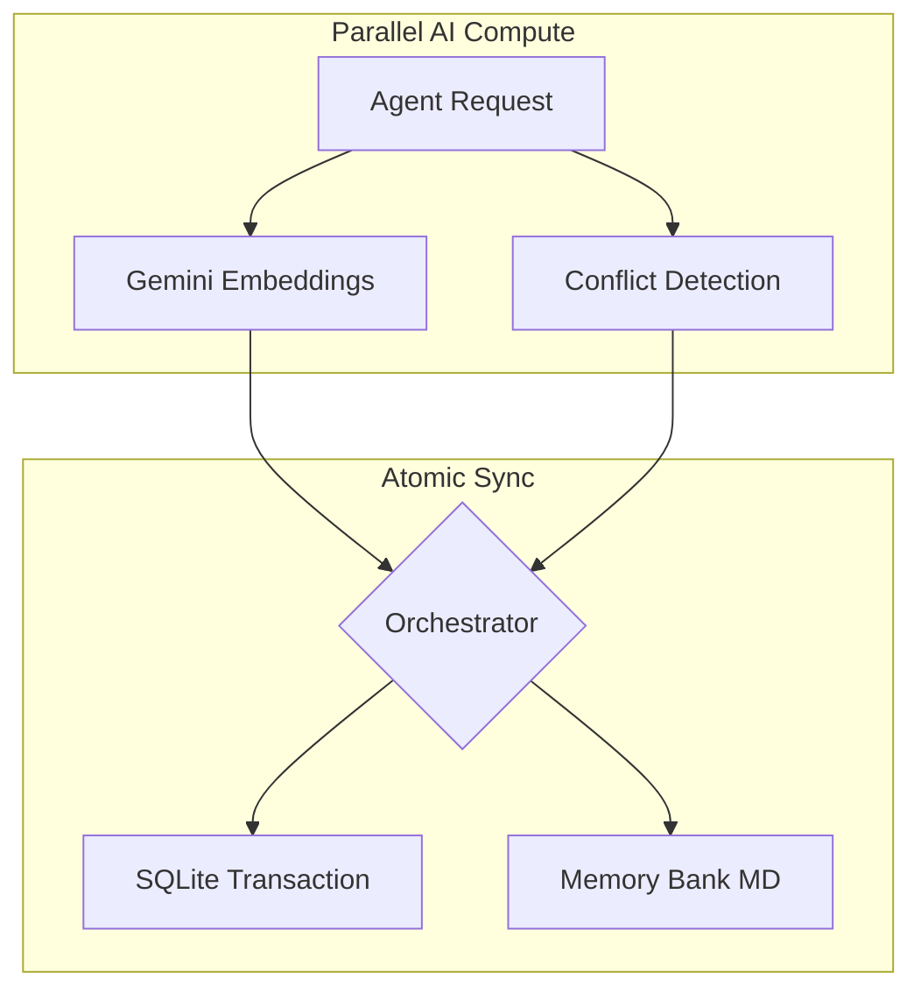

# SharedMemoryServer: State Governance for Agentic Intelligence 🚀

[](LICENSE)
[](COMMERCIAL.md)

SharedMemoryServer is a production-grade infrastructure designed to govern **Inference-time Latency** and **System Entropy** in complex Agentic Workflows. It provides a persistent, high-integrity context layer that survives ephemeral session boundaries.

## 🎯 Core Value
This project demonstrates verified proof of:
- **State Governance**: Managing reasoning continuity across sessions.
- **Architectural Determinism**: Enforcing data integrity through atomic synchronization.
- **Intelligence Provenance**: Quantifying the maturity and reuse of knowledge assets.
- **Team-Scale Knowledge Hub**: Centralizing agentic memory across developers via a persistent SSE server.

---

## 🏗️ Architecture at a Glance
SharedMemoryServer utilizes a **Compute-then-Write** pattern to eliminate database lock contention, ensuring high performance even with multiple simultaneous agents.



👉 **[Deep Dive into Architecture](docs/architecture.md)**

---

## ⚡ Quick Start

### 1. Installation
```bash
uv pip install -e .
```

### 2. Execution
- **Mode A (SSE - Recommended)**: Centralized hub for team collaboration.
  ```bash
  uv run shared-memory --sse --port 8377
  ```
- **Mode B (STDIO)**: Isolated local use.
  ```bash
  uv run shared-memory
  ```

### 3. Verification
Run the 16-test suite covering Chaos, System, and Unit scenarios:
```bash
uv run pytest tests -v
```

---

## 🛡️ Governance & Licensing

This project is dual-licensed to ensure both community openness and commercial sustainability:

- **Open Source**: Licensed under the [GNU Affero General Public License v3.0 (AGPL-3.0)](LICENSE). Any network service provided using this software must release its source code.
- **Commercial**: For SaaS use cases or proprietary integration without AGPL-3.0 obligations, a [Commercial License](COMMERCIAL.md) is available.

**Contributing:** We welcome contributions! Please see our [Contributing Guide](CONTRIBUTING.md) and note that a [CLA agreement](CLA.md) is required for all pull requests.

---
*Built to elevate AI Agents from "Simple Assistants" to "Systematic Thinking Assets".*
